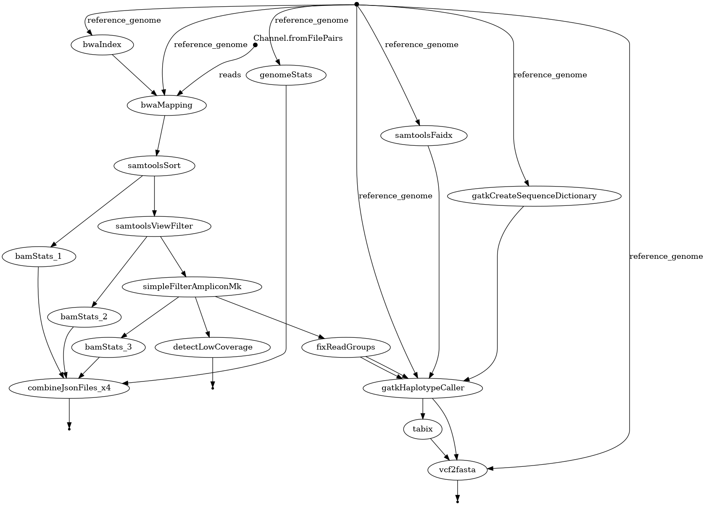

# Nextflow experimental pipeline for the SARS-CoV-2 WGS data

This is experimental pipline used for the analysis SAR-CoV-2 genome, and exploration of the [Nextflow](https://www.nextflow.io/docs/latest/index.html) framework.

Currently, the pipeline performs the following steps:

# Dependencies

This pipeline requires the following software to be installed:

- python 3.9.x
- bwa
- samtools
- bedtools
- bcftools
- tabix
- mafft
- [picard](https://broadinstitute.github.io/picard/)
- [gatk4](https://gatk.broadinstitute.org/hc/en-us)

Also install packages from `requirements.txt`:

    pip install -r requirements.txt

By default, picard is expected to be in /opt/picard/picard.jar, and gatk4 is expected to be in /opt/gatk/gatk. If you have them installed elsewhere, you can specify their location with the `--picardPath` and `--gatkPath` flags, respectively in `run_nf_pipeline.sh` file.

# Installation

Download and install the latest version of [Nextflow](https://www.nextflow.io/). Run it wherever you wish to keep executable. Use the command: 

    wget -qO- https://get.nextflow.io | bash

And put the resulting `nextflow` executable in your `$PATH`.

# Run script

Make a copy of run script and adjust run parameters by copying the template:

    cp run_nf_pipeline.sh.template run_nf_pipeline.sh

Edit flags in `run_nf_pipeline.sh` to adjust the run parameters.

##### Mandatory params
- `--reference_genome` : path to the reference genome (fasta file)
- `--reads` : path to the reads (fastq files).
 
> [!IMPORTANT]
> Reads MUST:
>  - be a single path to one or more file **pairs**.
>  - be enclosed in single quotes
> Example:  `'path/to/reads/sample_*_{1,2}.fastq.gz'`

##### Optional params
- `--picardPath` : path to picard jar file (default: /opt/picard/picard.jar)
- `--gatkPath` : path to gatk jar file (default: /opt/gatk/gatk)

# Run pipeline

Run the pipeline locally with:

    ./run_nf_pipeline.sh

# Results

Results will be in the `work` directory.
In addition, `report.html` will be generated in project root directory.

# Docker
To build the docker image, use the following command:

    docker build -t nf-pipeline:latest .

Container contains only scripts and executables, actual pipeline definition have to be cloned from git, and run by natively installed nextflow.

Here is an example of running the pipeline in docker container:

    nextflow run nf_pipeline.nf \
     --reference_genome /path/to/reference/genome.fasta \
     --reads '/path/to/reads/sample.*_{1,2}.fastq.gz' \
     -config nextflow.config \
     -with-dag flowchart.png \
     -with-report report.html \
     -with-docker nf-pipeline:latest \
     -resume

Further reading: [Nextflow Docker](https://www.nextflow.io/docs/latest/container.html#docker)
