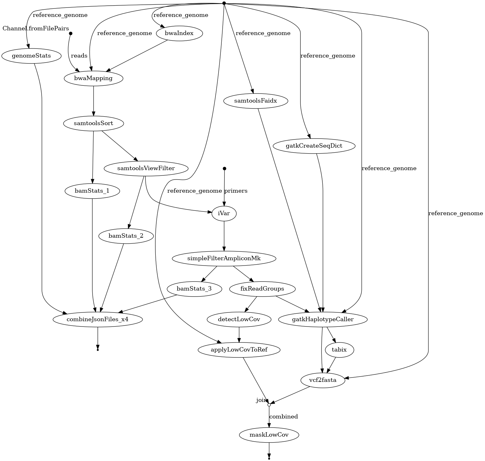

# Nextflow experimental pipeline for the analysis of the SARS-CoV-2 genome

This is experimental pipline used for the analysis SAR-CoV-2 genome, and exploration of the [Nextflow](https://www.nextflow.io/docs/latest/index.html) framework.

Currently, the pipeline performs the following steps:

# Dependencies

This pipeline requires the following software to be installed:

- python 3.9.x
- bwa
- samtools
- nproc
- [picard](https://broadinstitute.github.io/picard/)
- [gatk4](https://gatk.broadinstitute.org/hc/en-us)

Also install packages from `requirements.txt`:

    pip install -r requirements.txt

By default, picard is expected to be in /opt/picard/picard.jar, and gatk4 is expected to be in /opt/gatk/gatk. If you have them installed elsewhere, you can specify their location with the `--picardPath` and `--gatkPath` flags, respectively in `run_nf_pipeline.sh` file.

# Installation

Download and install the latest version of [Nextflow](https://www.nextflow.io/). Run it wherever you wish to keep executable. Use the command: 

    wget -qO- https://get.nextflow.io | bash

And put the resulting `nextflow` executable in your `$PATH`.

# Run script

Make a copy of run script and adjust run parameters by copying the template:

    cp run_nf_pipeline.sh.template run_nf_pipeline.sh

Edit flags in `run_nf_pipeline.sh` to adjust the run parameters.

##### Mandatory params
- `--reference_genome` : path to the reference genome (fasta file)
- `--reads` : path to the reads (fastq file).
 
Reads MUST:
 - be a single path to two files.
 - be enclosed in single quotes (e.g. `'path/to/reads/*_{1,2}.fastq.gz'`).
 - be in the format `*_{1,2}.fastq.gz` (e.g. `sample1_1.fastq.gz` and `sample1_2.fastq.gz`).

##### Optional params
- `--picardPath` : path to picard jar file (default: /opt/picard/picard.jar)
- `--gatkPath` : path to gatk jar file (default: /opt/gatk/gatk)

# Run pipeline

Run the pipeline locally with:

    ./run_nf_pipeline.sh

# Results

Results will be in the `work` directory.
In addition, `report.html` will be generated in project root directory.
